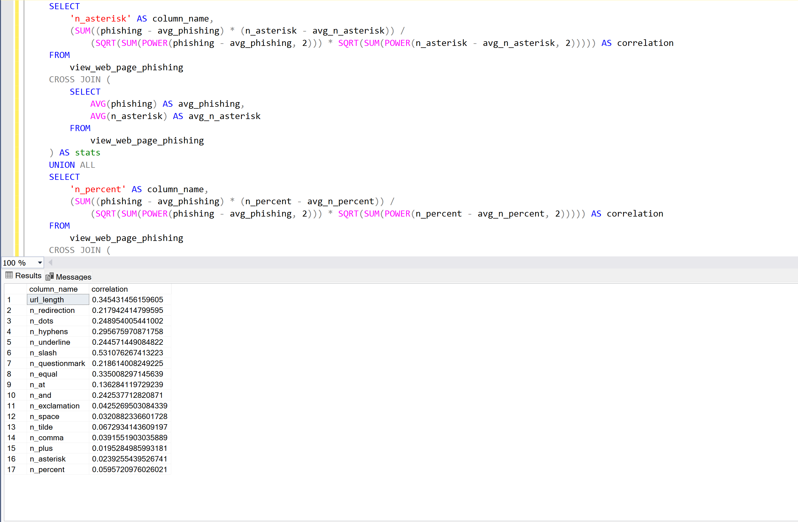

# Report Web Page Phishing

# Table of contents 

- [Correlation Analysis of Columns with Phishing Indicator](#correlation-analysis-of-columns-with-phishing-indicator)
  - [Objective](#objective)
  - [Data Description](#data-description)
  - [Methodology](#methodology)
    - [Calculation of Correlation Coefficients](#calculation-of-correlation-coefficients)
    - [SQL Implementaion](#SQL-implementaion)
  - [Conclusion](#conclusion)
- [Correlation Analysis of url_length and Phishing](#correlation-analysis-of-url_length-and-phishing)
  - [Target](#target)
  - [SQL Code](#SQL-code)
  - [Outcome](#outcome)
- [Correlation Analysis of n_redirection and Phishing](#correlation-analysis-of-n_redirection_and_phishing)
  - [Goal](#goal)
  - [SQL Application](#SQL-application)
  - [Statistical Analysis](#statistical_analysis)
-  [Analysis](#analysis)


## Correlation Analysis of Columns with Phishing Indicator

### Objective:
The goal of this analysis is to calculate the correlation coefficients between several numeric columns in a database view (view_web_page_phishing) and a binary indicator (phishing). These correlations will help determine the strength and direction of linear relationships between each column and the likelihood of a web page being classified as phishing.

### Data Description:
Edited the original data from Kaggle to include a new field called unique_id which assigns each row a unique number. I also changed the datatypes of all the fields to INTEGERS loading it into a VIEW named view_web_page_phishing. 

### Methodology:

#### Calculation of Correlation Coefficients:
I would need to use the following formula for the code where X would be the field phishing and Y would be the respective field I am finding.
```math
Correlation = \frac{\sum (X - \bar{X}) \cdot (Y - \bar{Y})}{\sqrt{\sum (X - \bar{X})^2 \cdot \sum (Y - \bar{Y})^2}}
```

#### SQL Implementaion:
```sql
WITH correlations AS (
    SELECT
        'url_length' AS column_name,
        (SUM((phishing - avg_phishing) * (url_length - avg_url_length)) / 
            (SQRT(SUM(POWER(phishing - avg_phishing, 2))) * SQRT(SUM(POWER(url_length - avg_url_length, 2))))) AS correlation
    FROM
        view_web_page_phishing
    CROSS JOIN (
        SELECT
            AVG(phishing) AS avg_phishing,
            AVG(url_length) AS avg_url_length
        FROM
            view_web_page_phishing
    ) AS stats
    UNION ALL
-- Repeat the above pattern for each column...
)
SELECT * FROM correlations;
```

### Conclusion:
The SQL code provides a systematic approach to calculating correlation coefficients between each numeric column and the phishing indicator in the view_web_page_phishing view. As a result with a correlation of 0.531 n_slash appears to be the field with the strongest correlation to phishing while with a correlation of 0.0195 n_plus is the field with the weakest correlation to phishing. 


## Correlation Analysis of url_length and Phishing

### Target:
The target of this analysis is to calculate the correlation coefficients between the length of the URL(url_length) in a database view (view_web_page_phishing) and a binary indicator (phishing). These correlations will help determine the strength and direction of linear relationships and the likelihood of a web page being classified as phishing using the length of the URL.


### SQL Code:
This code also uses the previously stated formula listed in [Calculation of Correlation Coefficients](#calculation-of-correlation-coefficients)
```sql
WITH Stats AS (
    SELECT
        AVG(CAST(phishing AS FLOAT)) AS avg_phishing,
        AVG(CAST(url_length AS FLOAT)) AS avg_url_length,
        SUM(CAST(phishing AS FLOAT) * CAST(url_length AS FLOAT)) AS sum_xy,
        SUM(CAST(phishing AS FLOAT) * CAST(phishing AS FLOAT)) AS sum_x2,
        SUM(CAST(url_length AS FLOAT) * CAST(url_length AS FLOAT)) AS sum_y2,
        COUNT(*) AS n
    FROM
        view_web_page_phishing
)
SELECT
    (Stats.sum_xy - Stats.n * Stats.avg_phishing * Stats.avg_url_length) / 
        (SQRT((Stats.sum_x2 - Stats.n * POWER(Stats.avg_phishing, 2)) * (Stats.sum_y2 - Stats.n * POWER(Stats.avg_url_length, 2)))) AS correlation_coefficient
FROM
    Stats;
```

### Outcome:
Based on the statistical analysis it appears that the length of the URL has a moderate indication as to whether a URL is phishing or not as after implementing the SQL code there was a correlation of around 0.43 between the two fields.


## Correlation Analysis of Columns with Phishing Indicator

### Goal:
This report aims to investigate whether the number of redirections (n_redirection) in URLs serves as a strong indicator of whether the URL is likely to be phishing or legitimate.

### SQL Application:
This code also uses the previously stated formula listed in [Calculation of Correlation Coefficients](#calculation-of-correlation-coefficients)
```sql
WITH Stats AS (
    SELECT
        AVG(CAST(phishing AS FLOAT)) AS avg_phishing,
        AVG(CAST(n_redirection AS FLOAT)) AS avg_n_redirection,
        SUM(CAST(phishing AS FLOAT) * CAST(n_redirection AS FLOAT)) AS sum_phishing_n_redirection,
        SUM(CAST(phishing AS FLOAT) * CAST(phishing AS FLOAT)) AS sum_phishing_squared,
        SUM(CAST(n_redirection AS FLOAT) * CAST(n_redirection AS FLOAT)) AS sum_n_redirection_squared,
        COUNT(*) AS n
    FROM
        view_web_page_phishing
)
SELECT
    (Stats.sum_phishing_n_redirection - Stats.n * Stats.avg_phishing * Stats.avg_n_redirection) / 
        (SQRT((Stats.sum_phishing_squared - Stats.n * POWER(Stats.avg_phishing, 2)) * (Stats.sum_n_redirection_squared - Stats.n * POWER(Stats.avg_n_redirection, 2)))) AS correlation_coefficient
FROM
    Stats;
;
```

### Statistical Analysis:
Based on the statistical analysis it appears that the number of redirections has a very weak almost 0 indication as to whether a URL is phishing or not as after implementing the SQL code there was a correlation around -0.05 between the two fields.


## Analysis:
  To effectively decipher whether a URL is phishing or not, it's crucial to employ a comprehensive approach that leverages multiple detection methods and analytical techniques. Instead of relying solely on isolated features like the number of redirections (n_redirection), organizations should adopt a diversified strategy. Furthermore, it's imperative to assess the strength of each indicator by calculating correlation coefficients between different URL attributes and the phishing status. Different industries or user behaviors can influence what constitutes a suspicious URL pattern. Tailoring detection strategies to accommodate these nuances enhances the precision of phishing detection systems. By utilizing supervised learning algorithms to analyze historical phishing data, organizations can uncover intricate patterns and relationships across multiple features.

  An integrated approach that combines diverse detection methods, rigorous correlation analysis, domain-specific insights, and advanced machine learning is essential for effectively deciphering whether a URL poses a phishing threat. By embracing these strategies, organizations can fortify their cybersecurity posture and mitigate risks associated with malicious URLs more effectively.

